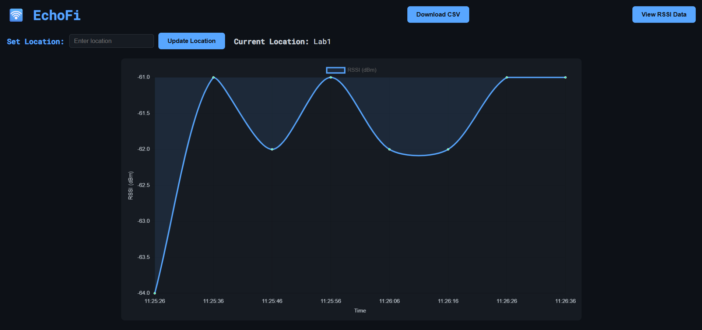
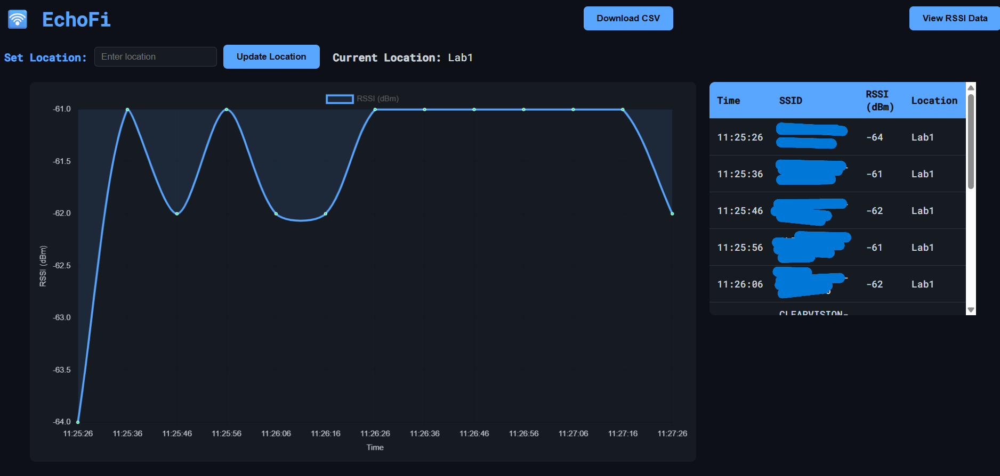
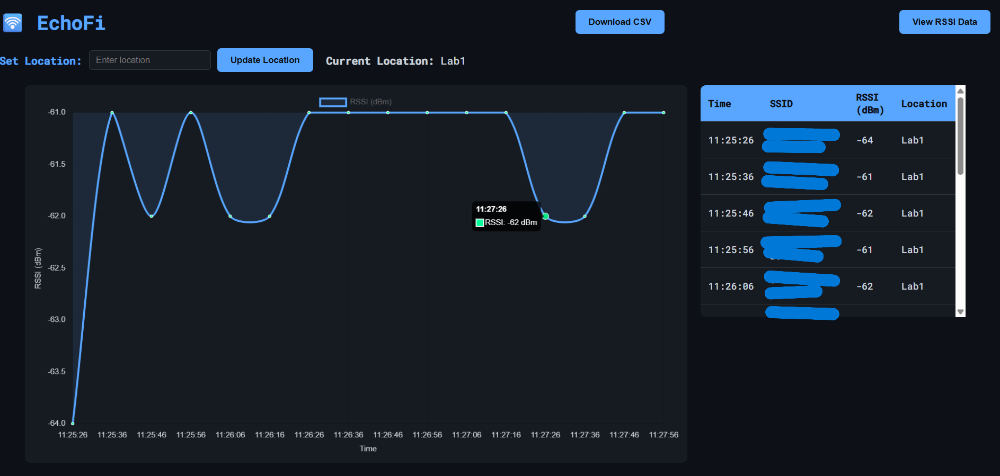
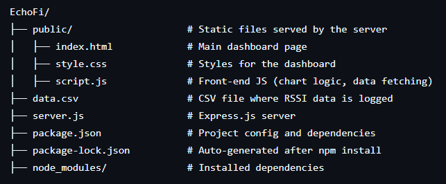

# EchoFi
EchoFi is a WiFi signal logger and analyzer built with NodeMCU (ESP8266), Node.js, and a dynamic web dashboard. It continuously tracks the RSSI (signal strength) of your home WiFi at different locations and visualizes the data in real-time with an interactive web interface.
# Features
==> Real-Time WiFi RSSI Monitoring: NodeMCU collects signal strength at regular intervals.

==> Live Dashboard: Displays RSSI readings on a responsive web UI with dynamic charts.

==> Location Support: Tag each measurement with a specific location in your home/building.

==> Downloadable CSV: Save all logged data as a CSV file with a single click.

==> Data Analytics Ready: View min, max, average, and standard deviation per location for easy analysis.

==> ESP8266 + Common Anode 7-Segment Display: shows the time left to send the data to the webpage.
# How It Works
The NodeMCU (ESP8266) scans the current WiFi RSSI.

RSSI readings, along with SSID and location, are sent via HTTP POST to a Node.js server.

The Node.js backend appends each reading to a CSV file (data.csv).

The front-end dashboard (hosted by the Node.js server) loads the latest data:

Renders a responsive RSSI graph using Chart.js.

Shows an interactive table with historical readings.

Displays the current selected location.

Allows you to update the measurement location dynamically.

Offers a one-click CSV download of all readings.

The NodeMCU hardware displays time left to send the next RSSI value  on a 7-segment.

# Hardware Components
==> NodeMCU ESP8266 — Core microcontroller for WiFi and HTTP.

==> 2-digit 7-segment display (common anode)

# Software Stack
==> Node.js with Express for backend and CSV logging.

==> Chart.js for real-time signal strength graph.

==> Custom CSS/JS/HTML for a responsive dashboard.
# File Structure Should be

# Getting Started
1. Backend Setup
Clone the repo:
git clone https://github.com/Krishnanunni11/EchoFi.git
cd EchoFi

2. Install dependencies:
npm init -y
npm install express cors body-parser

4. Start the server:
node index.js

Run the Server:
node server.js

6. Server will listen on http://localhost:3000

# Dashboard Usage
Visit http://localhost:3000 in your browser.

==> View the live RSSI graph.

==> Download historical data as CSV.

==> Update the current measurement location.

# Example CSV Data
Time,SSID,RSSI,Location
14:57:23,YOUR_SSID,-76,Room4
14:57:33,YOUR_SSID,-76,Room4
14:57:43,YOUR_SSID-77,Room4
14:57:53,YOUR_SSID,-76,Room4

# Analysis You Can Do
With CSV data, you can:

==> Compute average RSSI per location.

==> Find min and max RSSI per spot.

==> Visualize signal coverage as a heatmap of your house.

==> Perform standard deviation analysis to check signal stability.

